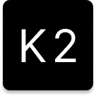

# K2 - Kemono & Coomer Downloader

<div align="center">



**High-Performance Content Downloader for Kemono & Coomer**

[](LICENSE)
[](https://www.python.org/)
[](https://www.riverbankcomputing.com/software/pyqt/)

---

### 💎 Get Pre-compiled Version

**Ready-to-use binary available here:** [K2 2.0.0 Binaries](https://ko-fi.com/s/69553f3227)

No Python installation required • Professional installer included • Instant setup

---

</div>

## 📖 Introduction

K2 is a powerful and high-performance content downloader for **Kemono** and **Coomer** platforms. Built with a modern PyQt6 graphical interface, it offers multi-threaded downloading, intelligent caching, and flexible filtering capabilities to make content management simple and efficient.

**Supported Platforms**: Kemono.su • Coomer.su

## 📸 Screenshot


*K2's intuitive interface with real-time download progress and filtering options*

## ✨ Key Features

### 🚀 Exceptional Performance
- **Lightning-fast metadata fetching**: Collect metadata for 10,000 posts in just 90 seconds
- **Multi-threaded concurrent downloads**: Maximize bandwidth utilization with parallel downloads
- **Intelligent creator data caching**: Avoid redundant API requests for faster response times

### 🎯 Flexible Filtering
- **Tag filtering**: Quickly filter content by tags
- **Extension filtering**: Support for images, videos, archives, and more
- **Custom post range**: Precise control over download scope with start/end post selection
- **Smart content selection**: Download exactly what you need

### 📁 Smart Naming System
- **Customizable creator folder naming**: Use templates like `{creator_name} ({creator_id}) - {service}`
- **Customizable post folder naming**: Templates support `{post_id}`, `{post_title}`, and more
- **Flexible file naming**: Full control over downloaded file names with variable templates

### 🌍 Multi-language Support
- English (en_US)
- Simplified Chinese (zh_CN)

### 💾 Data Caching
- **Local creator information caching**: Reduce API load and improve performance
- **Persistent storage**: Fast loading on subsequent runs

## 📥 Getting the Software

### Option 1: Pre-compiled Binary (Paid)

Pre-compiled binary installers are available at: **[K2 2.0.0 Binaries](https://ko-fi.com/s/69553f3227)**

Once purchased, you can install and use the software directly without any setup.

**Benefits:**
- ✅ Ready to use immediately
- ✅ No Python installation required
- ✅ No compilation knowledge needed
- ✅ Professional installer included
- ✅ Instant download after purchase

### Option 2: Build from Source (Free)

If you're familiar with Python development, you can build K2 from source code at no cost.

**Prerequisites:**
- Python 3.12 or higher
- Git
- Basic command-line knowledge

**Build Steps:**

```bash
# 1. Clone the repository
git clone https://github.com/smkelpt/KemonoDownloader.git
cd KemonoDownloader

# 2. Install dependencies
pip install -r requirements.txt

# 3. Build with Nuitka
python -m nuitka --standalone --onefile \
    --enable-plugin=pyqt6 \
    --windows-icon-from-ico=src/k2/resources/icons/K2.ico \
    --include-data-dir=src/k2/resources=k2/resources \
    --output-dir=dist \
    --company-name="K2" \
    --product-name="K2" \
    --file-version=2.0.0 \
    --product-version=2.0.0 \
    --file-description="Kemono Downloader" \
    src/k2/__main__.py
```

After building, the executable will be located in the `dist/` directory.

**Note**: Building from source requires technical knowledge and may take significant time (up to 30+ minutes) depending on your system.

## 🎮 Usage Guide

### 1. Add Creators
- Enter the creator ID and select the service platform
- Click the "Add Creator" button
- The creator will be added to your download list

### 2. Set Filter Conditions
- **Tag Filter**: Select specific tags to include or exclude
- **Extension Filter**: Choose which file types to download
- **Post Range**: Set start and end post numbers for selective downloading

### 3. Configure Naming Rules
Customize how your downloads are organized:
- **Creator Folder Template**: `{creator_name} ({creator_id}) - {service}`
- **Post Folder Template**: `{post_id} {post_title}`
- **File Name Template**: `{file_name_original}{file_ext}`

Available variables:
- `{creator_name}` - Creator's display name
- `{creator_id}` - Creator's unique ID
- `{service}` - Platform service name
- `{post_id}` - Post ID
- `{post_title}` - Post title
- `{file_name_original}` - Original file name
- `{file_ext}` - File extension

### 4. Start Downloading
- Set your desired download path
- Click "Start Download"
- Monitor real-time progress with detailed statistics
- Pause/resume as needed

## 📋 Supported File Formats

By default, K2 supports the following file types:

- **Images**: `.jpg`, `.jpeg`, `.png`, `.gif`, `.webp`
- **Videos**: `.mp4`, `.mov`, `.avi`, `.mkv`, `.ts`
- **Archives**: `.zip`, `.rar`, `.7z`, `.tar`, `.001`

You can customize the extension filter to include or exclude specific file types.

## ⚙️ Performance Features

### Multi-threaded Downloads
- Default concurrency: 5 simultaneous downloads
- Configurable thread count for optimal performance
- Efficient queue management

### Intelligent Caching
- Creator metadata is cached locally
- Reduces server load and improves response time
- Automatic cache updates when needed

### Optimized Network Usage
- Smart retry logic for failed downloads
- Bandwidth-friendly request patterns
- Minimal API overhead

## 🛠️ Tech Stack

- **GUI Framework**: PyQt6 - Modern and responsive interface
- **Network Requests**: requests, beautifulsoup4 - Reliable HTTP handling
- **User Agent Rotation**: fake-useragent - Avoid rate limiting
- **Packaging**: Nuitka - Fast compilation and optimization
- **Installer**: Inno Setup - Professional Windows installer

## 📝 License

This project is licensed under the [MIT License](LICENSE).

You are free to use, modify, and distribute this software in accordance with the license terms.

## 🤝 Contributing

Contributions are welcome! Here's how you can help:

- 🐛 Report bugs and issues
- 💡 Suggest new features or improvements
- 🔧 Submit pull requests
- 📖 Improve documentation
- 🌍 Add translations for new languages

Please feel free to open an issue or submit a pull request on GitHub.

## ⚠️ Disclaimer

**Important**: This tool is provided for educational and personal use only.

- ✅ Respect the website's terms of service
- ✅ Comply with local laws and regulations
- ✅ Honor content creators' copyrights
- ❌ Do not use for commercial purposes without permission
- ❌ Do not redistribute downloaded content without authorization

The developers of K2 are not responsible for any misuse of this software. Users are solely responsible for their actions and must ensure compliance with all applicable laws and terms of service.

## 📧 Contact

For questions, issues, or suggestions, please visit:
- **GitHub**: [https://github.com/smkelpt/KemonoDownloader](https://github.com/smkelpt/KemonoDownloader)
- **Issues**: [GitHub Issues](https://github.com/smkelpt/KemonoDownloader/issues)

---

<div align="center">

**Made with ❤️ by [smkelpt](https://github.com/smkelpt)**

⭐ Star this repository if you find it useful!

</div>
